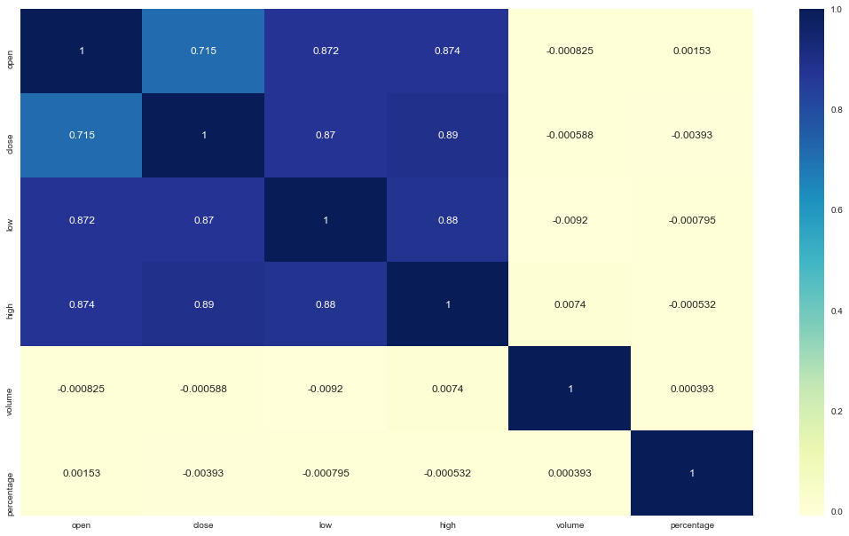
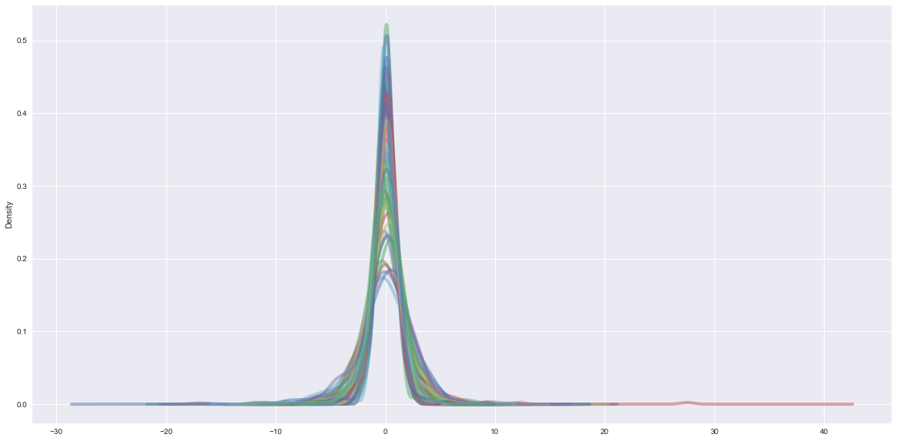
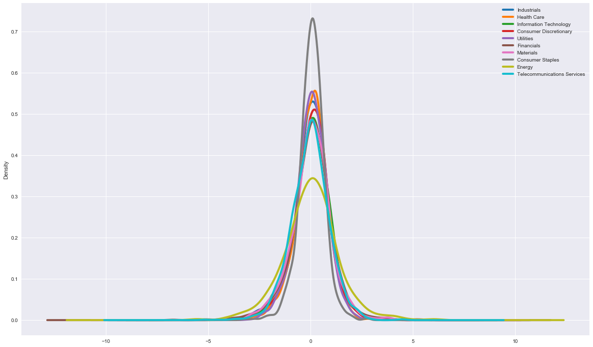
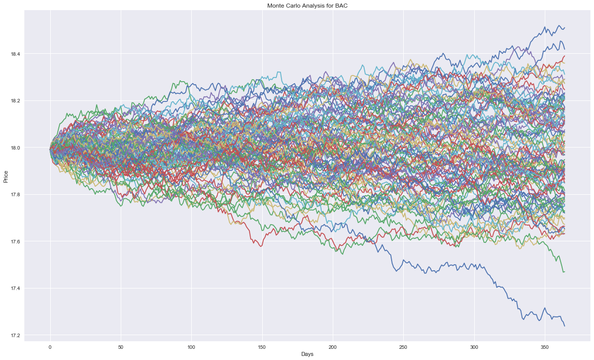
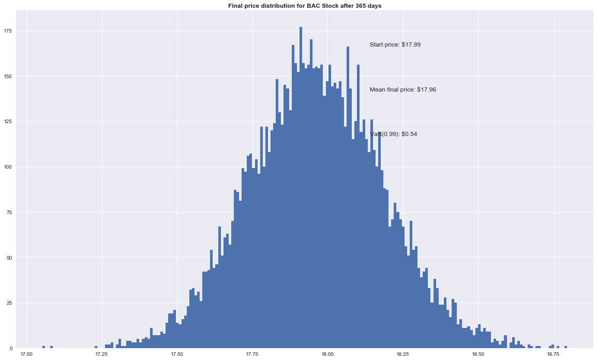
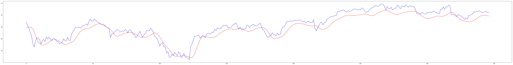

# Stock Prices Analysis and Exploration

## Motivation:
Nature of the project: Stock market is always a thrilling place for people to participate in the financial activities. To push myself into exploring the world of finance, my project focus on technical analysis of the stock value changes. By answering some of the questions I proposed, I aim at gaining a basic understanding of the stock market and knowing more about the application of machine learning in financial world. With limited knowledge in business and finance, I will follow the methodologies of some existing explorations in stock value analysis and prediction, and will not dig into the mathematic models or financial concept. But, according to Efficient Market Hypothesis (a famous theory in financial economics that states that asset prices fully reflect all available information. A direct implication is that market prices should only react to new information.), stock value prediction based on past stock value information is a nearly impossible task, I will mainly focus on studying the data manipulation and analysis tools rather than beating the market.

## Data Source: 
For this project I will be using New York Stock Exchange dataset(url: https://www.kaggle.com/dgawlik/nyse/data ) posted on Kaggle for stock value prediction. The dataset keeps track of the stock value of 500 companies over the period of year 2010 to year 2016. There are two csv files in the datasets: securities.csv that provides general description of each company with division on sectors. It has 507 rows of data with one row for each company. It has 8 variables: Ticker symbol (i.e. MMM), Security (the company name, i.e. 3M Company), SEC filings (which won’t be taken into concern in my project), GICS Sector(the sector it belong, i.e. Industrials), GICS Sub Industry(i.e. Industrial Conglomerates), Address of Headquarters(i.e. St. Paul, Minnesota), Date first added(i.e. 3/31/1964), CIK(won’t be used in my project, i.e. 66740). The file can be downloaded through this link.

## Analysis and Results: 
Overall conclusion: Stock value changes cannot be predicted using past stock value information, but we can still learn something about the stock market by looking at the history. 
### 1. Predict the stock value changes without taking the time series into consideration, in terms of binary trend (UP and Down) and numeric change.
Interpretation and Analysis:
With the random guess method producing an accuracy of 50.3%(like flipping a coin), I used this accuracy as a baseline in this question to see whether the binary classification method can beat it. The accuracy of Naïve Bayes and Random Forest are both higher(but not much higher) than random guess. But since that the stock value changes are sensitive to too many information, it is expected that prediction based on only the sequence of stock prices will not work well.
The features I used for these two methods can somehow take the sequence of 10 days’ changes in stock prices into concern. However, the result proves that these methods won’t be an efficient tool to predict whether the stock price will go up or down. Also, I notice that volume is a variable that is assigned with higher importance, and it encourages me to have a closer look into the relationship of volume and stock prices changes in Question 2.
In the Kfold validation part, I keep only the open and close price of the stock as matrix to feed a multilayer perceptron network, and see if part of the data can be used to predict another part. At the beginning, I got a very low error with the K to be 2, 3, and 4, but it doesn’t make sense in real cases because the stock price will not show such a predictable pattern with only two variables. So I redo the validation for 20
times with K=5 and found that the error will jump high sometimes, which proves that this method won’t work either.
For Monte Carlo simulation part, I just do it for fun and try to understand this famous method used in Math and Physics, so even though the result is consistent with other attempts (that stock prices cannot be predicted with past information), it doesn’t provide any support to the Efficient Market Hypothesis. By using Monte Carlo, the mean final price is 17.96 and the distribution doesn’t even cover the actual final price 16.40, which means that using the history stock value in this way doesn’t make sense.

### 2. Explore the relationship of stock prices changes with respect to daily trading volume. Is the stock volume highly related to stock value changes?
Interpretation and Analysis: The top 5 companies that have the greatest sum of volume are BAC, CHK, FCX, GOOG, F. So I plot the daily stock price changes and volume changes of these five companies, and I discover that large amount of volume often occur around the days when stock value has been going down for a long time. And CHK, FCX are having a greater sum of volume in recent years, which indicates that these two companies are experiencing greater changes and therefore the investors are more interested in them. It is also interesting that BAC, even with a steady growing in stock prices, doesn’t have an increasing volume, and FCX is having increasing volume even when its stock prices are going down. One explanation for this phenomenon could be that investors are afraid of the stock with continuous growing and would rather to buy stocks whose price have been going down for a long time. The heat map of the correlation between each variable in the prices dataset indicates that volume is not an important factor that contributes to stock value changes.

### 3. Explore the difference in stock value changes for stocks that belong to different sectors.
Interpretation and Analysis: The plot for distribution of daily return in Information Technology sector shows that not all companies have the same pattern in stock prices change. Some of them are experiencing more rapid changes than others, and most of them are having taller curves, which means that the stock value changes of stocks in IT sector are significant. One explanation could be that, Information Technology is still one of the most heated topic in this era so people are paying attention to it, so every news in IT can result in significant changes in stock value. From the plot of the distribution of daily return, we can see that the distribution of all sectors are roughly a normal distribution, which indicates that all the sectors are relatively stable in stock prices changes as a whole. Among these sectors, Comsumer Staples sector have a slimer and taller plot which indicates that this sector has a lower risk but also lower profit for the investors. On the contrary, Energy sector is the most risky sector and is least stable in stock value changes.

### 4. Predict the stock value changes with the time series into consideration, using LSTM.
Interpretation and Analysis: The blue curve is the actual price changes and the red curve is the predicted changes (Using example of Cisco). It is interesting that the predicted stock value changes has surprisingly high consistency with the actual price changes, which means that the stock value changes can be predicted by using LSTM. Though the predicted price is a smooth curve that deviate from reality, the model can capture the fluctuation of the stock price. However, I feel this model and method is problematic because the Efficient Market Hypothesis in finance area proposes that stock prices should only react to new information but not the past information. It is difficult for me to identify what might have been wrong, or test how the model works with other stocks because I am not familiar with TensorFlow.

